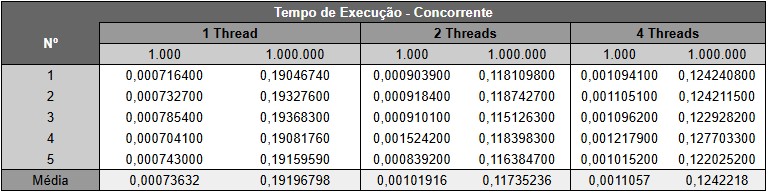
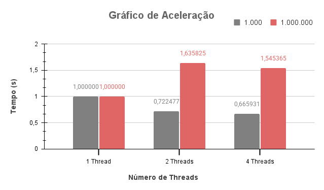
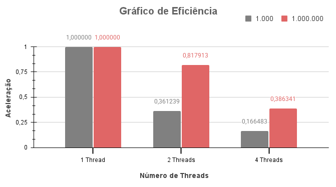

## ⚙️ Configurações da Máquina
A máquina utilizada na realização dos testes possui as seguintes configurações:
- **Sistema Operacional**: Linux Mint 21 Cinnamon
- **Versão do Cinnamon**: 5.4.12
- **Kernel do Linux**: 5.15.0-101-generic
- **Processador**: 13ª geração Intel® Core™ i5-13500, com 14 núcleos

 

## 🔍 Análise dos Resultados
Após executar 5 vezes cada configuração, foram obtidos os seguintes tempos médios de execução para os diferentes números de threads e tamanhos de entrada:

Com base nos tempos médios obtidos, foram calculadas a aceleração e a eficiência, utilizando as seguintes métricas:

$$Aceleração (n, t) = \frac{T_p(n, 1)}{T_p(n, t)}$$

$$Eficiência (n, t) = \frac{Aceleração (n, t)}{t}$$

**Onde:**
* $$T_p(n, 1)$$ : Tempo concorrente de $$n$$ com 1 thread;
* $$n$$ : Dimensão das matrizes;
* $$t$$ : Quantidade de threads usadas na execução.

Assim, foram obtidos os seguintes resultados: 
 

## 💡 Conclusão
A partir dos testes realizados, observei que o uso de threads é mais vantajoso para valores de *N* suficientemente grandes. Para *N* = 1.000, a versão sequencial apresentou desempenho superior, já que o tempo de criação e sincronização das threads acabou sendo maior do que o tempo necessário para executar a tarefa de forma direta. Ou seja, nesse caso, a concorrência prejudicou o desempenho.

Já com *N* = 1.000.000, o uso de threads melhorou bastante o tempo com **2 threads**, mas com **4 threads** não teve um ganho significativo. Isso pode ter ocorrido devido à limitação do número de núcleos da máquina utilizada ou pelo aumento da disputa entre as threads pelo acesso à variável compartilhada, o que pode gerar atrasos por conta do uso do mutex.
